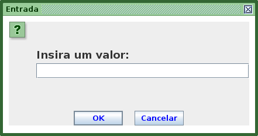
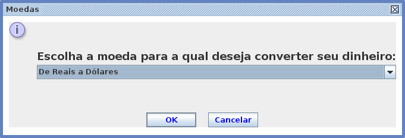
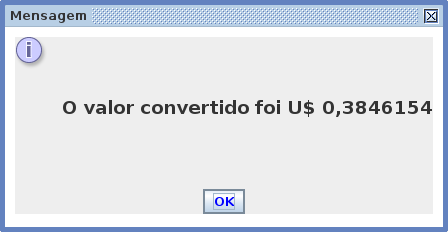
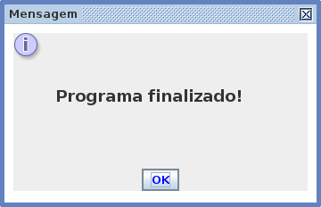
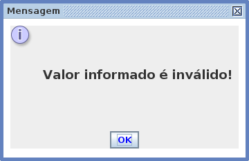
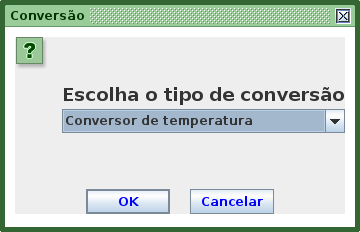
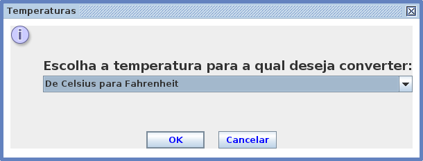
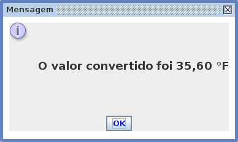

<h1 align="center"> Conversor de Moedas e Temperaturas </h1>
<h2 align="center"> Este projeto foi feito para o Challenge ONE Back End T4 - Java Sprint 01
<h2 align="center"> Crie seu próprio conversor de moeda 

  

   

	
 

<h2>  Tools and Technologies</h2>

 
  
   
   
 

 

Foram utilizados o framework Swing e a classe UIManager.

Converte moedas nos seguintes formatos:
<ul>
<li>De Reais a Dólares
<li>De Reais a Euros
<li>De Reais a Libras Esterlinas
<li>De Reais a Peso Argentino
<li>De Reais a Peso Chileno
<li>De Reais par Yenes
<li>De Reais para Won Sul Coreano
<li>De Dólares a Reais
<li>De Euros a Reais
<li>De Libras Esterlinas a Reais
<li>De Peso Argentino a Reais
<li>De Peso Chileno a Reais
<Li>De Yenes a Reais
<li>De Won Sul Coreano a Reais
                
e temperaturas:  

				De Celsius para Fahrenheit
				De Fahrenheit para Celsius
				De Celsius para Kelvin
				De Kelvin para Celsius  
           
                
O valor das moedas é fixo, obtidos na internet no dia 06/03/2023

<h2> Telas do Aplicativo </h2>
 

                     

